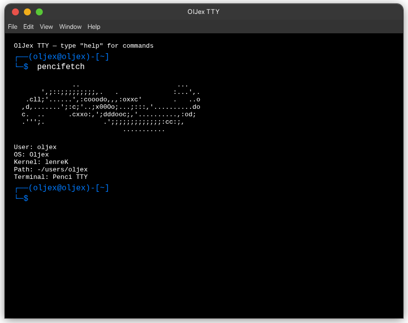

# Oljex OS

An electron based TTY OS made with HTML, CSS and JS.

---

## Features ✨

- Fast and Lightweight
- HTML5 + JS based OS for joke.
- TTY Terminal Interface
- Command Line Interface
- Electron Based
- Own Kernel

---

## Installation 

```bash
git clone https://github.com/YusufErdemK/oljex.git
cd oljex
npm install
npm start
```

### Requirements
- nodejs
- npm

---


## Usage

It boots a TTY terminal interface where you can use various commands like `ls`, `pwd`, `cd`, `mkdir`, `touch`, `tree`, `pencifetch`, `useradd`, `su`, `passwd`, `nano`, `clear`, and `help`.


## Screenshot



## How It Works

Oljex OS is built using Electron, which allows for the creation of desktop applications using web technologies. The core of Oljex is a terminal emulator that interprets user commands and interacts with a virtual filesystem implemented in JavaScript. The terminal interface is styled with CSS to provide a retro TTY look and feel. Commands are parsed and executed within the Electron environment, allowing for a seamless user experience.

---

## License

MIT License - see LICENSE file for details

---

## Author
Developed by erdamn (Yusuf Erdem Kaymak)

## Social Medias

[](https://github.com/YusufErdemK)&nbsp;&nbsp;
[](https://www.instagram.com/theyee1903/)
